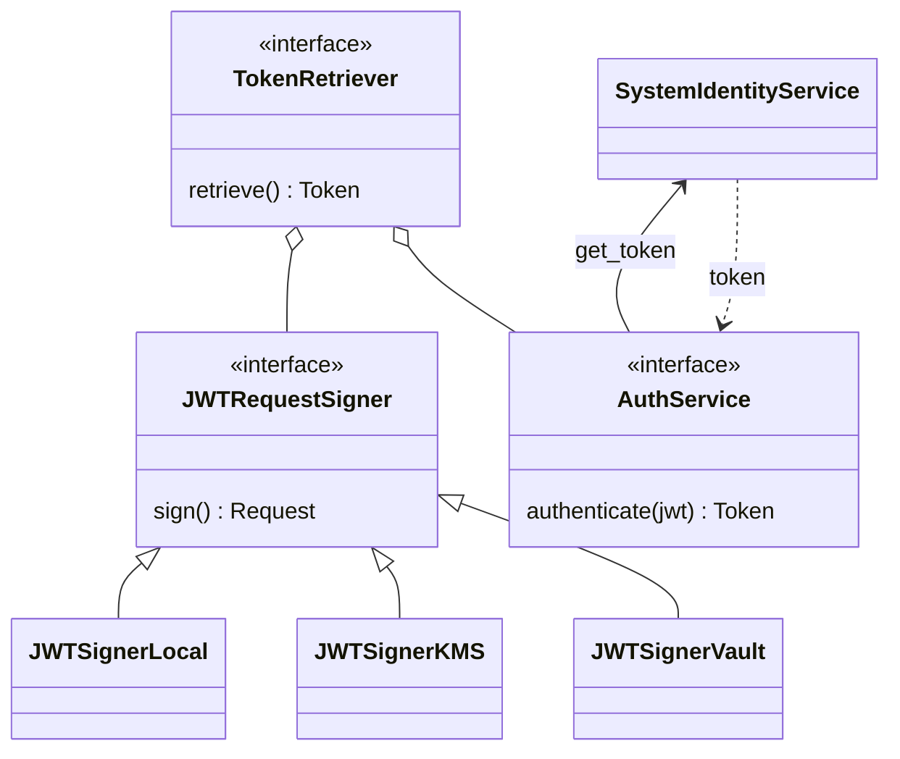

# nr-auth

`nr-auth` aims to provide all the functionality needed to authenticate with System Identity Service and retrieve
authorization tokens to make authenticated and authorized requests to Fleet Management.

It exposes the trait `TokenRetriever` which exposes a single method `retrieve` which will retrieve a token with
an expiration time:

```rust
pub trait TokenRetriever {
    fn retrieve(&self) -> Result<Token, TokenRetrieverError>;
}
```

Token:

```rust
pub struct Token {
    expires_at: DateTime<Utc>,
    access_token: AccessToken,
    token_type: TokenType,
}
```

The access token will be used to make authenticated and authorized requests to Fleet Management.

## Architecture


